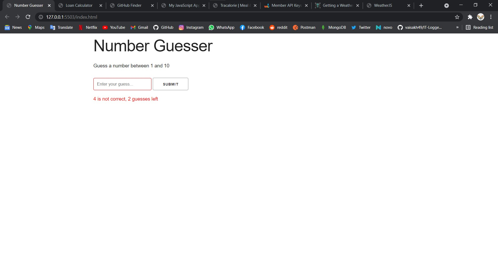
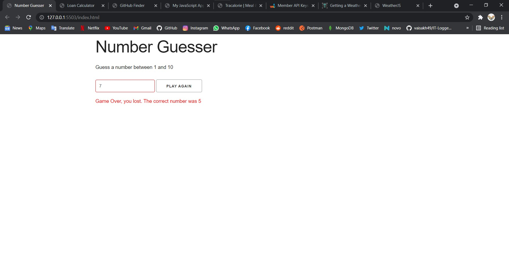
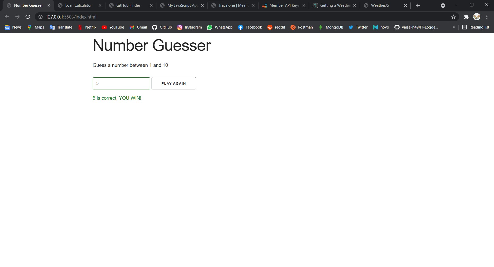

# Number_guesser_js
Simple number guessing game with vanilla javascript.

<a href='https://xenodochial-goldstine-12da89.netlify.app/'>Go to site</a>

<h2>Screenshots</h2>

<h3>Guessing</h3>
 
 <h3>lose</h3>
 
 <h3>win</h3>
 
